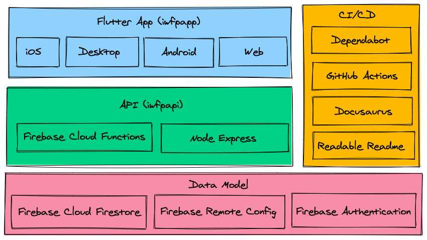

# Contribute to the `iwfp` project

## Overview



## Getting Started with the client apps: `iwfpapp`

This part contains all the client apps (Android, IOS and Web). The project is written in a cross-platform
framework, [@Flutter](https://flutter.dev/).

### Install Flutter

Please see the instructions @ [Getting Started with Flutter](https://flutter.dev/docs/get-started/install).

### Upgrade Flutter to the Latest

The `iwfp` project automatically compiles to all platforms which is only supported through
the latest master channel [@Flutter](https://flutter.dev/).

```bash
# we are the cool kids that are always
# at the bleeding edge of the technology
flutter channel master
flutter upgrade
```

### Run the `iwfp` app in dev mode

Depending on which platform the app should be running on, a Android Emulator, iPhone/iPad Emulator or a chrome
browser should be running. [@Flutter](https://flutter.dev/) should be able to detect the platform automatically.

```bash
cd iwfpapp
flutter pub get
flutter run 
```
