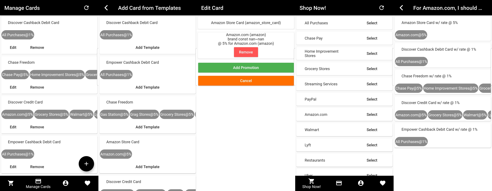

I want 5% (iwfp) is a utility to help everyone who uses credit cards maximize cash back rewards.

**A quick look** (where you select a shopping category and it tells you which card is the best):

## Getting Started

I want 5% is available on:
- [x] Android (available on [Google Play Store](https://play.google.com/store/apps/details?id=com.jacksonz.iwfpapp&hl=en_US))
- [x] Web (available at [I Want 5% Web](https://iwfpapp.web.app))
- [ ] iOS
  - [x] Code complete
  - [x] Third-party compatibility
  - [ ] Need sponsorship for the $99/year Apple developer account :broken_heart:
- [ ] MacOS
  - [x] Code complete
  - [ ] Third-party compatibility
- [ ] Windows (not planned. Although [Flutter](https://flutter.dev/) will support it, who knows what will happen when I enable it :scream:)

For the latest updates, please subscribe to [newsletter](https://jacksonz.substack.com).

## Helpful Resource

* [Project Site](https://iwfp.github.io/iwfp-home/)
* App (iwfpapp)
  * [Coverage Report](https://iwfp.github.io/iwfpapp-coverage-report/)
  * [Dev documentation](https://iwfp.github.io/iwfpapp-doc/)
* API (iwfpapi)
  * [Dev documentation](https://iwfp.github.io/iwfpapi-doc/)

## Contribute

Contribution of any kind (code, docs, suggestions, etc) is appreciated! Please see [CONTRIBUTING.md](./CONTRIBUTING.md) for details.